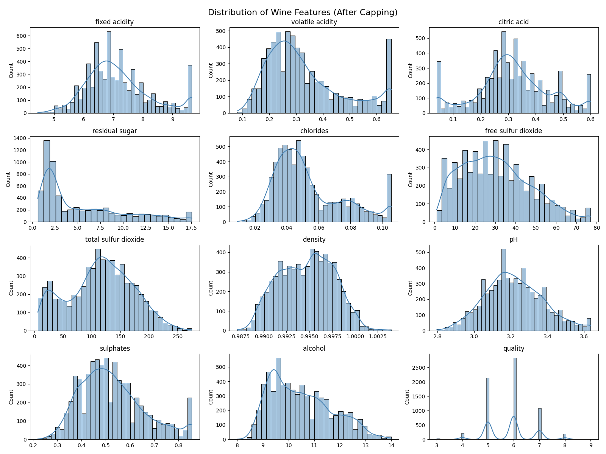
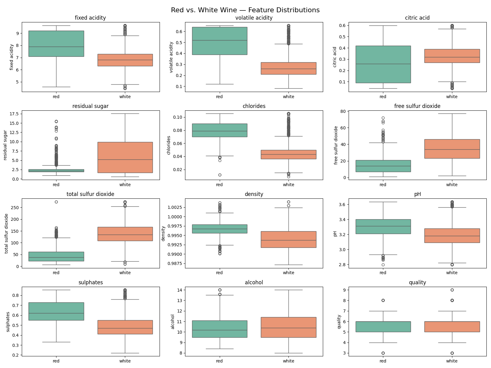
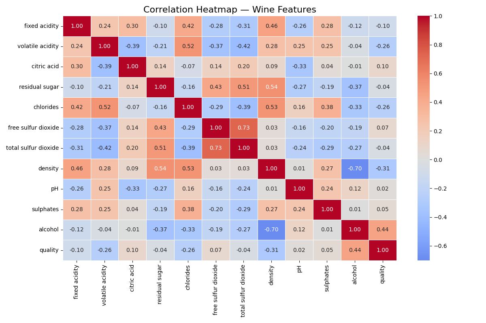

# Wine Quality — Exploratory Data Analysis

## Overview

This project performs an exploratory data analysis (EDA) on the UCI Wine Quality
dataset, combining red and white Vinho Verde wines to explore the biochemical
features that influence quality scores.

**Dataset:** UCI Wine Quality (Vinho Verde) — red + white combined  
**Shape:** 6,497 rows × 13 columns  
**Target variable:** `quality` (score 0–10)

## Project Structure
```
wine-quality-eda/
│
├── data/
│   ├── winequality-red.csv
│   └── winequality-white.csv
├── images/
│   ├── distribution_after_capping.png
│   ├── red_vs_white_boxplots.png
│   └── correlation_heatmap.png
├── notebook/
│   └── eda.ipynb
├── requirements.txt
└── README.md
```
## Key Findings

This EDA explored the biochemical composition of 6,497 red and white Vinho Verde
wines. After capping outliers in residual sugar, free sulfur dioxide, and chlorides,
three main findings emerged:

- **Wine type drives chemistry:** white wines have significantly higher residual
  sugar and total sulfur dioxide, while red wines have higher volatile acidity —
  all consistent with known winemaking practices.
- **Alcohol is the strongest predictor of quality:** with a correlation of 0.44,
  higher alcohol content is associated with better quality scores.
- **Density reflects physical composition:** strongly negatively correlated with
  alcohol (-0.70) and positively with residual sugar (0.54), density acts as a
  summary variable of the wine's dissolved content.

Quality scores were concentrated between 5 and 7, suggesting the dataset contains
few exceptional or very poor wines, which may limit predictive modeling in later stages.

## Visualizations

### Feature Distributions (After Capping)


### Red vs. White Wine Comparisons


### Correlation Heatmap


## How to Run

1. Clone the repository
2. Install dependencies: `pip install -r requirements.txt`
3. Launch Jupyter: `jupyter notebook notebook/eda.ipynb`

## Tools Used

- Python 3
- Pandas
- Matplotlib
- Seaborn